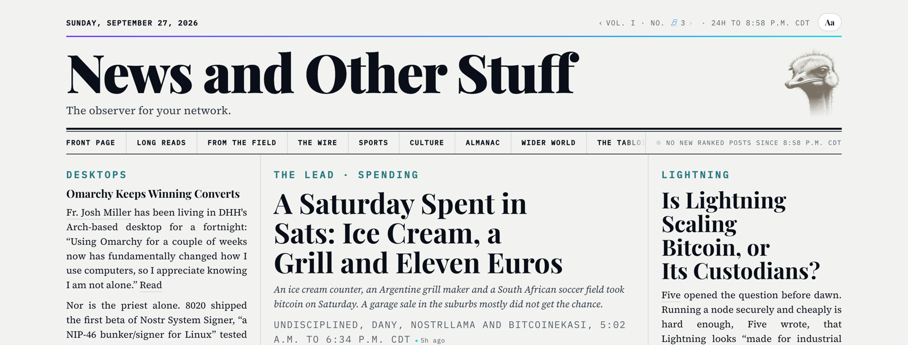

# News and Other Stuff

*The observer for your network.* A personal daily paper, printed each morning
from what the people you trust on Nostr actually said, ranked by
[Brainstorm](https://brainstorm.world). Everything runs on your own machine,
through your own Claude Code.



This is a fork of [NosFabrica/the-nostr-observer](https://github.com/NosFabrica/the-nostr-observer)
(MIT), kept by [Megistus XYZ](https://www.megistus.xyz). It adds the Brainstorm
edition and a living copy with accessible reader settings, credits in one
"Sources & licences" list, issue numbers, the Feature and the back page.
Improvements that help any Observer reader are offered back upstream as small
pull requests; the brand and the edition's own choices stay here. See
[NOTICE](NOTICE) for the marks and pictures, which the MIT licence does not
cover.

**What you need.** [Claude Code](https://claude.com/claude-code), Node 22 or
newer, and a Nostr account with a Brainstorm web-of-trust lens: the paper is
ranked through it. Lenses are set up by the Brainstorm team for now, not by a
button: sign in at [brainstorm.world](https://brainstorm.world) and ask for
yours. Until it is ready, a readiness check stops before printing and says
what it is waiting on. The ranked relay is Brainstorm's `search-staging` while
the lens service is in beta.

**Run it.** Open this repository in Claude Code and ask
`print my Nostr Observer`. It asks for your npub and, once, for your place,
teams, feeds and the pages you want, and writes `observer.config.json` for
you; `observer.config.example.json` shows every setting. Your papers land in
`editions/`, which is never committed. You can name your paper and set its
motto; the Brainstorm edition (`"brand": "brainstorm"`) and the ostrich stamps
are marks listed in [NOTICE](NOTICE), not covered by the MIT licence. The
Tape (share closes) is off by default: Yahoo's terms do not permit automated
collection, so turning it on is for personal use at your own risk.

**Keeping up with upstream.** Once, after cloning:

```bash
git remote add upstream https://github.com/NosFabrica/the-nostr-observer.git
```

Then, whenever NosFabrica moves, merge it into `megistus-edition`:

```bash
git fetch upstream && git merge upstream/main
```

The original project's README follows.

---

# The Nostr Observer

Your own daily newspaper, printed from your corner of Nostr.

Sign in, and once a day the Observer reads everything the people you trust have
posted in the last 24 hours and lays it out as a front page — a lead story,
photographs, a books-and-gardens column, whatever the day actually contained.
It is written fresh each morning, so a quiet Tuesday looks like a quiet Tuesday
and a big day gets a big headline.

It is **your** paper in a literal sense. The stories are chosen by your own web
of trust, not by an algorithm we tuned, and the finished page is published to
your own media servers under your own key. We print it; you own it.

## What you need

- **A Nostr account**, with a signer — a browser extension or a remote signer app.
- **A web-of-trust lens.** This is what makes the paper yours rather than a
  firehose. If you do not have one yet, the Observer will offer to set one up
  and tell you when it is ready.
- **A media server** (Blossom), if you want to publish and share your editions.
  You can read your own paper without one.

## What it costs you

Nothing but the storage on your own media server — about the size of a couple of
emails per edition. Photographs stay where their authors put them; the Observer
only points at them.

## Sharing

Every edition you publish gets a link you can hand to anyone. They do not need an
account to read it. Editions you do not publish stay yours and are visible to
nobody else.

## Status

Early, but it runs. You can sign in with an extension or a remote signer, and the
Observer will read your web of trust, print a page, show it to you privately and
publish it to your media servers when you say so.

Two things are not finished. Setting up a web-of-trust lens for a brand new
reader still needs a person at our end; until yours is ready the Observer tells
you exactly what it is waiting on rather than printing a paper chosen some other
way. And editions are made on demand — a paper that arrives every morning without
you asking is next.

## Try it in Claude Code

There is a taster that runs entirely on your own machine, with no account here
at all: a Claude Code skill that reads your web of trust, prints a front page
and hands it to you as an artifact. It uses your own Claude Code — no API key,
nothing to sign up for.

Open this repository in Claude Code — the terminal, the desktop app, or
[claude.ai/code](https://claude.ai/code) in a browser — and just ask:

```
print my Nostr Observer
```

The skill lives at [`.claude/skills/nostr-observer`](.claude/skills/nostr-observer),
so a checkout of this repo already has it; there is nothing to install. To have
it everywhere instead of only here, copy it into your own skills directory:

```bash
cp -r .claude/skills/nostr-observer ~/.claude/skills/
```

Each run leaves its paper in `editions/`, on your machine and gitignored,
alongside the corpus it was written from. It does not publish to your media
servers and it does not arrive every morning.

If you want one of those papers on the open web, a second skill does only that:

```
publish today's paper
```

[`.claude/skills/observer-pages`](.claude/skills/observer-pages) copies the
editions you *name* into `dist/` and deploys that folder to Vercel. It never
uploads `editions/` — the corpus is your whole ranked window and it stays off
the web — and it refuses to deploy a paper you did not ask for.

That one does need an account: a free Vercel Hobby account and `npx vercel
login` once per machine. You pick the project name and it becomes the address.
Nothing there needs an agent either — `site.mjs` is an ordinary CLI and the
whole path is a handful of commands. Both routes, and what gets published
versus what stays on your disk, are written up in
[the skill's README](.claude/skills/observer-pages/README.md).

The design is written up in [`docs/PLAN.md`](docs/PLAN.md).

---

Built by [NosFabrica](https://github.com/NosFabrica) on
[vespa-relay](https://github.com/NosFabrica/vespa-relay).
